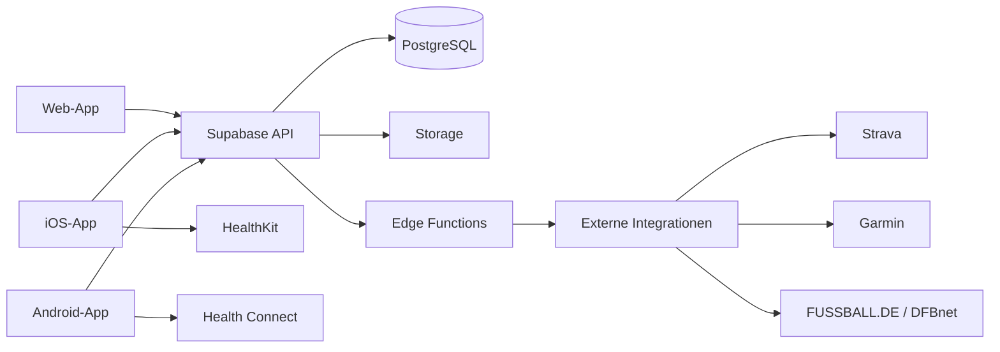
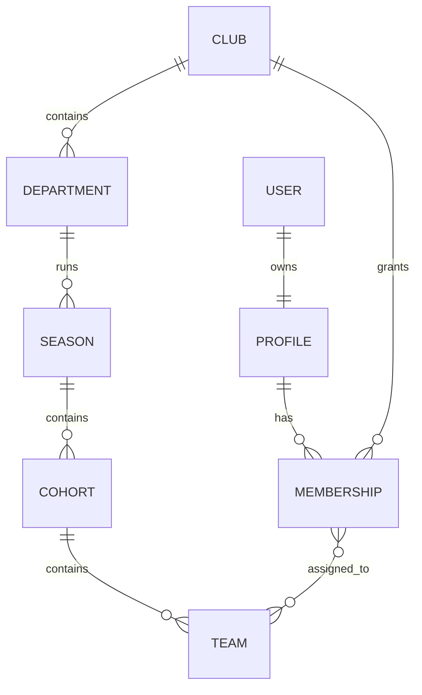

# Teamapp – Technische Architektur und Datenmodell

Status: Entwurf 1.0

Grundlage: [Produktspezifikation](./PRODUCT_SPEC.md) und [UX-Abläufe](./UX_FLOWS.md)

## 1. Architekturentscheidung

Für den Vereinspiloten wird eine gemeinsame TypeScript-Codebasis vorgesehen:

- Expo und React Native für iOS und Android
- React Native Web für die Weboberfläche
- Expo Router für Navigation und plattformübergreifende Routen
- Supabase für PostgreSQL, Authentifizierung, Dateispeicher und serverseitige Funktionen
- Row Level Security als verpflichtende Zugriffsschicht
- Push-Benachrichtigungen über Expo Notifications
- Integrationsadapter als serverseitige Funktionen und Hintergrundaufgaben

Die fachliche Logik wird nach Modulen getrennt. Plattformabhängiger Code ist nur für Funktionen wie HealthKit, Health Connect, Push und sichere lokale Speicherung vorgesehen.

## 2. Systemübersicht



## 3. Mandanten- und Organisationsmodell

Jeder fachliche Datensatz wird direkt oder indirekt einem Verein zugeordnet. Zugriffsregeln prüfen neben der Benutzeridentität auch Vereinsmitgliedschaft, Saison, Jahrgang, Mannschaft und Rolle.



## 4. Fachmodule

```text
app/
├── auth
├── organizations
├── members
├── calendar
├── availability
├── squad-planning
├── matchday
├── statistics
├── finance
├── individual-training
├── notifications
└── integrations
```

Jedes Modul besitzt UI, Validierung, Datenzugriff, Typen und Tests. Gemeinsam genutzte Komponenten und fachfreie Hilfsfunktionen liegen in separaten Shared-Paketen.

## 5. Kerndatenmodell

### Organisation und Identität

| Tabelle | Zweck |
|---|---|
| `clubs` | Verein und Grundeinstellungen |
| `departments` | Abteilung oder Sportart |
| `seasons` | Saison mit Start, Ende und Archivstatus |
| `cohorts` | Jahrgang innerhalb einer Saison |
| `teams` | B1, B2 und weitere Mannschaften |
| `profiles` | persönliche Profildaten zum Auth-Benutzer |
| `guardian_links` | Eltern-Kind- beziehungsweise Stellvertreterbeziehung |
| `memberships` | Vereinsmitgliedschaft und Status |
| `team_memberships` | Stammteam und weitere Mannschaftszuordnung |
| `team_membership_roles` | teambezogene Rollen, z. B. Spieler oder Trainer |
| `member_invitations` | zeitlich begrenzte Einladung an eine E-Mail-Adresse |
| `invitation_team_assignments` | Teams und Rollen, die beim Annehmen vergeben werden |
| `roles` | definierte Rollen |
| `role_assignments` | Rollenzuordnung mit Gültigkeitsbereich |

### Spieler und Positionen

| Tabelle | Zweck |
|---|---|
| `positions` | konfigurierbare Positionen und Positionsgruppen |
| `player_positions` | Haupt- und Nebenpositionen eines Spielers |
| `eligibilities` | Einsatzberechtigung pro Mannschaft und Saison |

### Termine und Verfügbarkeit

| Tabelle | Zweck |
|---|---|
| `events` | Termin mit Typ, Zeitraum, Ort und Status |
| `event_targets` | Jahrgang, Mannschaft, Gruppe oder Person als Zielgruppe |
| `event_responses` | Antwort und Antwortzeitpunkt |
| `absences` | Urlaub, Krankheit, Verletzung oder sonstige Abwesenheit |
| `availability_rules` | wiederkehrende Verfügbarkeit oder Sperrzeit |
| `capacity_rules` | Mindestwerte pro Terminart und Kontext |

### Vorsaison-Kaderplanung

| Tabelle | Zweck |
|---|---|
| `squad_plans` | Plan für Saison und Jahrgang |
| `squad_plan_versions` | gespeicherte Variante mit Status |
| `squad_targets` | Soll-Kadergröße und Positionsbedarf |
| `planned_assignments` | geplante Zuordnung eines Spielers |
| `squad_plan_comments` | Diskussion und Begründungen |

### Spieltag

| Tabelle | Zweck |
|---|---|
| `matches` | spielspezifische Angaben zum Termin |
| `nominations` | nominierter Spieler mit Status |
| `lineups` | Aufstellung und Veröffentlichungsversion |
| `lineup_slots` | Formation, Position, Spieler und Bank |
| `match_events` | Tor, Vorlage, Karte oder Wechsel |

### Finanzen

| Tabelle | Zweck |
|---|---|
| `cash_accounts` | Jahrgangs- oder Mannschaftskasse |
| `transactions` | unveränderlicher Buchungskopf |
| `transaction_allocations` | Zuordnung von Beträgen zu Personen |
| `penalty_types` | Strafenkatalog |
| `penalties` | zugewiesene Strafe und Status |
| `receipts` | Belegmetadaten und Storage-Verweis |

Finanzdaten verwenden ganzzahlige Werte in der kleinsten Währungseinheit. Salden werden aus Buchungen berechnet und nicht manuell überschrieben.

### Individuelles Training

| Tabelle | Zweck |
|---|---|
| `training_activities` | manuelle oder importierte Aktivität |
| `training_prescriptions` | Vorgabe eines Trainers |
| `prescription_targets` | Spieler oder Gruppe als Empfänger |
| `prescription_completions` | Erledigung und Rückmeldung |

### Integration und Betrieb

| Tabelle | Zweck |
|---|---|
| `integration_accounts` | verschlüsselte Verbindung und Einwilligung |
| `external_records` | Zuordnung externer IDs zu internen Daten |
| `sync_runs` | Status und Fehler eines Synchronisationslaufs |
| `notifications` | persistente In-App-Benachrichtigung |
| `audit_log` | sicherheitsrelevanter Änderungsverlauf |

## 6. Wichtige Modellregeln

- Ein Profil wird nicht pro Mannschaft dupliziert.
- Mannschaftszuordnungen sind saisonbezogen.
- Zielgruppen eines Termins werden explizit gespeichert und bei Veröffentlichung aufgelöst.
- Ein Spieler darf bei kollidierenden Spielen nicht ohne bestätigte Ausnahme doppelt nominiert werden.
- Nebenpositionen werden in der Kaderabdeckung als Alternativen und nicht als unabhängige Spieler gezählt.
- Bestätigte Kaderplanvarianten erzeugen versionierte offizielle Zuordnungen.
- Spielstatistiken werden aus bestätigten Spielereignissen berechnet.
- Kassenkorrekturen bewahren den ursprünglichen Buchungsverlauf.
- Importierte Aktivitäten besitzen eine eindeutige Kombination aus Quelle und externer ID.
- sensible Daten werden nur so lange gespeichert, wie Einwilligung und Zweck bestehen.

## 7. Berechtigungsmodell

Die Prüfung erfolgt in zwei Stufen:

1. Der Benutzer besitzt eine aktive Vereinsmitgliedschaft.
2. Eine Rolle erlaubt die Aktion im konkreten Gültigkeitsbereich.

Gültigkeitsbereiche sind Verein, Abteilung, Jahrgang, Mannschaft oder eigener Datensatz. Elternzugriffe werden zusätzlich über eine aktive Stellvertreterbeziehung geprüft.

Besonders getrennte Rechte:

- Fitness- und Reha-Daten lesen
- Kassenbuchungen lesen oder bearbeiten
- Rollen vergeben
- Kaderplan bestätigen
- Aufstellung veröffentlichen
- Spielereignisse bestätigen
- externe Integrationen verbinden

## 8. Berechnungen

### Kapazitätsplanung

Für ein Zeitfenster werden Mitglieder der gewählten Zielgruppe ermittelt. Abwesenheiten, Sperrzeiten und kollidierende Termine reduzieren die verfügbare Menge. Ergebnisse werden nach Rollen und Positionen gruppiert und gegen `capacity_rules` bewertet.

### Einsatzminuten

Einsatzzeiten entstehen aus Startelfstatus, Spielzeit, Wechseln und bestätigten Korrekturen. Die Berechnung muss bei jeder Ereignisänderung deterministisch wiederholbar sein.

### Kaderabdeckung

Die Hauptposition zählt als feste Abdeckung. Nebenpositionen werden separat als flexible Abdeckung ausgewiesen. Eine konfliktfreie Simulation verhindert, dass derselbe Spieler mehrere Sollplätze gleichzeitig vollständig erfüllt.

### Kassensaldo

Der Saldo ist die Summe bestätigter Einnahmen abzüglich bestätigter Ausgaben. Offene personenbezogene Forderungen werden separat ausgewiesen.

## 9. Integrationsarchitektur

Jeder Adapter implementiert dieselben Grundoperationen:

```text
connect → authorize → sync → normalize → deduplicate → persist → revoke
```

- OAuth-Tokens und vergleichbare Geheimnisse werden ausschließlich serverseitig verschlüsselt gespeichert.
- HealthKit- und Health-Connect-Daten werden auf dem Gerät gelesen und nur nach expliziter Auswahl übertragen.
- Synchronisationen sind wiederholbar und protokolliert.
- Anbieterfehler blockieren keine manuelle Erfassung.
- CSV, Excel und ICS dienen als kontrollierte Fallbacks.

## 10. Sicherheit und Datenschutz

- Row Level Security auf allen fachlichen Tabellen
- keine Service-Zugangsschlüssel in Client-Anwendungen
- kurzlebige Downloadlinks für private Dateien
- Audit-Log für Rollen, Kaderbestätigungen, Kasse und Statistikänderungen
- Einwilligungsprotokoll für Fitnessdaten
- Datenexport und Löschprozess pro Person
- Trennung von Produktanalyse und Vereinsinhalten
- minimale Datenerhebung bei Minderjährigen
- regelmäßige Sicherungs- und Wiederherstellungstests

## 11. Teststrategie

- Unit-Tests für Kapazitäts-, Einsatzzeit-, Kader- und Kassenberechnungen
- Datenbanktests für Row-Level-Security-Regeln
- Integrationstests für Terminveröffentlichung und Statistikaufbau
- Adaptertests mit gespeicherten, anonymisierten Beispieldaten
- End-to-End-Tests der zentralen Trainer-, Spieler-, Eltern- und Kassenabläufe
- manuelle Tests auf Web, iOS und Android
- Migrationstests mit realistisch großen Pilotdatensätzen

## 12. Technische Meilensteine

1. Monorepo, Qualitätswerkzeuge und lokale Entwicklungsumgebung
2. Datenbankmigrationen für Organisation, Rollen und Mitglieder
3. Anmeldung und rollenbasierte Navigation
4. Termine, Antworten und Verfügbarkeit
5. Kapazitätsberechnung
6. Vorsaison-Kaderplanung
7. Nominierung, Aufstellung und Spielereignisse
8. Statistik-Pipeline
9. Kasse und Strafenkatalog
10. individuelles Training
11. Integrationsadapter
12. Pilotdaten, Sicherheitstest und Testveröffentlichung

## 13. Offene technische Entscheidungen

- Hostingregion und Datenschutzvereinbarung des Backends
- konkrete Offline-Anforderungen
- gewünschte Push- und E-Mail-Anbieter
- PDF-Erzeugung auf Client oder Server
- Importformate des Pilotvereins
- verfügbare DFBnet-, FUSSBALL.DE- und Garmin-Zugänge
- Aufbewahrungsfristen für Fitness-, Finanz- und Auditdaten
- Mindestversionen von iOS und Android
